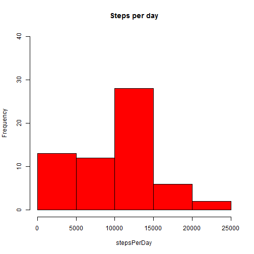
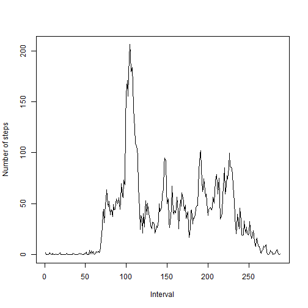
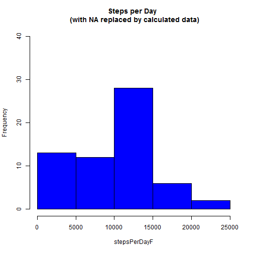
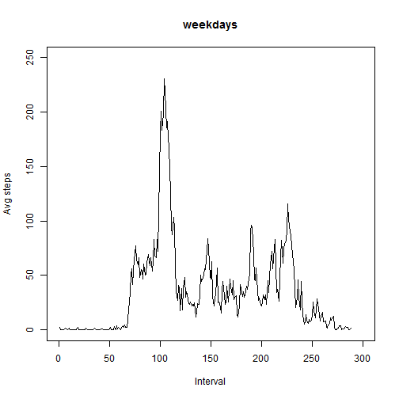
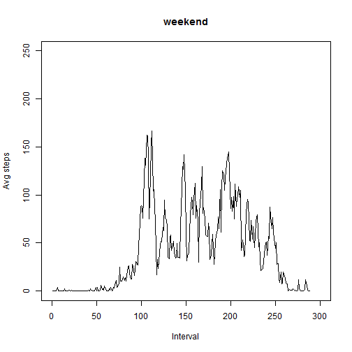

## Loading and preprocessing the data

load data 

```r
rawdata <- read.csv("activity.csv")
```
preprocessing (removing NA for first analysis)...  

```r
cleaned <- rawdata[complete.cases(rawdata),]
stepsPerDay <- sapply(split(cleaned$steps, cleaned$date),sum)
```

## What is mean total number of steps taken per day?

Make a histogram of the total number of steps taken each day  

```r
hist(stepsPerDay, col="red", main="Steps per day",ylim=c(0,40))
```

 

Calculate and report the mean and median total number of steps taken per day:  
this is the mean  

```r
print(mean(stepsPerDay))
```

```
## [1] 9354
```
this is the median  

```r
print(median(stepsPerDay))
```

```
## [1] 10395
```

## What is the average daily activity pattern?


```r
stepsPerInt <-sapply(split(cleaned$steps, cleaned$interval), mean)
plot(stepsPerInt, type = "l", , xlab = "Interval", ylab = "Number of steps")
```

 
Max in daily number of steps  

```r
  names(stepsPerInt[stepsPerInt==max(stepsPerInt)])
```

```
## [1] "835"
```
## Imputing missing values

the number of missing values in the initial dataset  

```r
sum(is.na(rawdata$steps))
```

```
## [1] 2304
```
fill the data for missing values with the average of each interval...  

```r
filled=rawdata
for (i in 1:nrow(filled)) {
    if (is.na(filled[i, "steps"])) {
        interval = as.character(filled[i, "interval"])
        filled[i, "steps"] = stepsPerInt[interval]
    }
}
```
Make a histogram of the total number of steps taken each day  

```r
stepsPerDayF <- sapply(split(cleaned$steps, cleaned$date),sum)
hist(stepsPerDayF, col="blue", main="Steps per Day \n (with NA replaced by calculated data)",ylim=c(0,40))
```

 
Calculate and report the mean and median total number of steps taken per day:  
this is the mean  

```r
print(mean(stepsPerDayF))
```

```
## [1] 9354
```
this is the median  

```r
print(median(stepsPerDayF))
```

```
## [1] 10395
```

## Are there differences in activity patterns between weekdays and weekends?
Add a factorized field in "filled" dataset in order to subset by weekday and by weekend day

```r
filled$weekday = weekdays(as.Date(filled$date, format = "%Y-%m-%d"), TRUE)
filled$is.a = factor(ifelse(filled$weekday == "dom" | filled$weekday == 
    "sab", "weekend", "weekday"), levels = c("weekday", "weekend"))
on.weekdays=filled[filled$is.a == "weekday", ]
on.weekend=filled[filled$is.a == "weekend", ]
```
Calculate averages and plot it

```r
weekdays.steps = sapply(split(on.weekdays$steps, on.weekdays$interval), 
    mean)
plot(weekdays.steps, type = "l", ylab = "Avg steps", xlab = "Interval", ylim = c(0, 250), xlim = c(0, 300), main = "weekdays")
```

 

```r
weekend.steps = sapply(split(on.weekend$steps, on.weekend$interval), 
    mean)
plot(weekend.steps, type = "l", ylab = "Avg steps", xlab = "Interval", ylim = c(0, 250), xlim = c(0, 300), main = "weekend")
```

 
